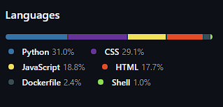

# Relatório Técnico: Projeto Integrador Docker e Nuvem

## 1. Descrição da Aplicação

A aplicação consiste em um portfólio institucional web integrado a uma API de monitoramento.

- **Frontend**: Aplicação SPA (Single Page Application) estática, desenvolvida com HTML5, CSS3 (efeitos de glassmorphism) e JavaScript Vanilla.
- **Backend**: API REST desenvolvida em Python com **FastAPI**, responsável por fornecer dados de saúde do sistema (health check) e métricas de uso (uptime, contador de visitas persistente).
- **Servidor Web**: **Nginx**, atuando como servidor de arquivos estáticos e Proxy Reverso para a API, tudo encapsulado em um único container.

## 2. Modelo de Serviço Escolhido: PaaS (Platform as a Service)

Optamos por utilizar o **Google Cloud Run**, um serviço de PaaS gerenciado "Serverless" para containers.

### Justificativa

O modelo PaaS foi escolhido pois abstrai a complexidade de gerenciamento do Sistema Operacional e do Hardware subjacente, permitindo focar exclusivamente no código e no container da aplicação.

### Benefícios

- **Automação**: O Google gerencia a infraestrutura, atualizações de segurança do host e provisionamento de recursos.
- **Custo-Benefício**: Modelo "Pay-as-you-go" (pague pelo uso). Se ninguém acessa o site, o custo tende a zero (dependendo da configuração de instâncias mínimas).
- **Simplicidade Operacional**: Deploy simplificado através de uma única imagem Docker, sem necessidade de configurar clusters Kubernetes complexos manualmente (embora o Cloud Run use Knative por baixo).

### Desafios

- **Cold Starts**: Como o serviço pode escalar a zero, a primeira requisição após um período de inatividade pode levar alguns segundos a mais para carregar enquanto o container é iniciado.
- **Cold Starts**: Como o serviço pode escalar a zero, a primeira requisição após um período de inatividade pode levar alguns segundos a mais para carregar enquanto o container é iniciado.
- **Estado (Statelessness)**: Containers no Cloud Run são efêmeros.
  - Implementamos uma funcionalidade de **"Registrar Visita"** que grava em um arquivo JSON local (`/data/visitas.json`) para demonstrar o uso de volumes.
  - **Importante**: Em produção no Cloud Run, esse arquivo é temporário. Se o container reiniciar, os dados somem. Isso prova o conceito de **Statelessness**: para persistência real em nuvem, deve-se usar serviços externos como Cloud SQL ou Cloud Storage, pois o disco local do container não é confiável a longo prazo.
  - No ambiente local (`docker compose`), o volume é mapeado para o disco do host, garantindo persistência total.

## 3. Arquitetura e Conceitos Aplicados

_Figura 1: Arquitetura Simplificada da Solução no Google Cloud Run_

### 3.1 Docker e Containerização

Utilizamos um **Dockerfile** que prepara uma imagem híbrida baseada em `python:3.11-slim`, instalando o `nginx` sobre ela. Isso permite que um único artefato de deploy contenha tanto a lógica de apresentação quanto a de negócio, simplificando a esteira de deploy.

### 3.2 Escalabilidade e Elasticidade

O Cloud Run oferece **Elasticidade Automática**.

- Se o tráfego aumentar repentinamente (ex: campanha de marketing), a plataforma provisiona automaticamente novas instâncias do container para lidar com a carga (Scale Out).
- Quando o tráfego diminui, as instâncias são desligadas (Scale In), otimizando custos.

### 3.3 Responsabilidade Compartilhada

No modelo PaaS/Cloud Run:

- **Provedor (Google)**: Responsável pela segurança física dos datacenters, rede, hardware e do sistema operacional host onde os containers rodam.
- **Cliente (Nós)**: Responsável pela segurança da aplicação (código), das dependências dentro do container (atualizar bibliotecas Python/Nginx) e pelo gerenciamento de acesso (IAM).

## 4. Estratégia de Deploy (CI/CD)

Implementamos uma esteira de Integração e Entrega Contínuas (CI/CD) utilizando **GitHub Actions**.

### Fluxo Automatizado

1.  **Trigger**: Commit na branch `main`.
2.  **Build**: O GitHub Actions constrói a imagem Docker.
3.  **Push**: A imagem é enviada para o **Google Artifact Registry** (repositório privado e seguro de imagens).
4.  **Deploy**: O comando `gcloud run deploy` atualiza o serviço em produção com a nova imagem.

Essa abordagem elimina erros manuais de deploy e garante que a versão em produção esteja sempre sincronizada com o código aprovado no repositório.

## 5. Melhorias Avançadas Implementadas

Para demonstrar maturidade e profundidade técnica, foram implementadas as seguintes melhorias que vão além dos requisitos básicos:

### 5.1 Observabilidade e Monitoramento

- **Logs em Tempo Real**: Implementamos um endpoint `/api/logs` que permite a visualização remota dos logs da aplicação direto no painel administrativo.
- **Health Check Avançado**: A rota `/api/healthcheck` não apenas retorna "ok", mas verifica a latência da API e a capacidade de escrita no disco (persistência).
- **Métricas e Dashboards**: Utilizamos **Chart.js** para plotar um gráfico de visitas em tempo real, consumindo dados do endpoint `/api/metrics`.

### 5.2 Segurança e Autenticação

- **Autenticação via Token**: Para proteger rotas sensíveis (como o Health Check detalhado), implementamos uma verificação de token (Header/Query Param). Sem o token correto, a API retorna apenas informações públicas.
- **Backup Automático**: Um **Cron Job** dentro do container realiza backups periódicos dos dados (`visitas.json`) para uma pasta segura, simulando uma estratégia de Disaster Recovery.

### 5.3 UX/UI Premium

- **Tema Híbrido (Dark/Light Mode)**: O usuário pode alternar entre temas, demonstrando domínio de CSS Variables e manipulação de DOM.
- **Micro-interações**: Animações de entrada (`FadeIn`) e efeitos de hover nos cards para uma experiência fluida.

### 5.4 Robustez e Confiabilidade (Resolução de Desafios)

Para garantir que a aplicação funcione perfeitamente em qualquer ambiente (dev local no Windows vs prod no Linux), implementamos estratégias de **Resiliência**:

- **Correção Automática de EOL**: Scripts shell (`entrypoint.sh`, `backup_script.sh`) sofrem limpeza automática de quebras de linha (`sed -i 's/\r$//'`) durante o build do Docker, prevenindo erros de "bad interpreter".
- **Orquestração de Processos**: O `entrypoint` gerencia múltiplos serviços (Cron, Nginx, Uvicorn) em um único container, garantindo que o monitoramento inicie em paralelo com a aplicação.
- **Fail-Safe no Backup**: O script de backup verifica a existência dos arquivos antes de tentar a cópia, evitando falhas silenciosas ou logs de erro desnecessários na inicialização.

### 5.5 Experiência do Usuário Avançada (UX 2.0)

Para elevar a experiência do usuário a um nível profissional, foram implementadas funcionalidades visuais modernas:

- **Toast Notifications**: Substituímos os alertas nativos do JavaScript (`alert()`) por notificações elegantes no estilo toast, que aparecem no topo da tela com animações suaves e ícones contextuais (✅ sucesso, ⚠️ aviso, ❌ erro).
- **Confetti Animation**: Ao registrar uma visita com sucesso, uma explosão de 50 partículas coloridas (confetes) preenche a tela, criando uma micro-interação celebratória que aumenta o engajamento.
- **Resource Gauges (CPU/Memory)**: Gráficos circulares em SVG animados simulam o uso de recursos do sistema (CPU e Memória RAM), atualizando dinamicamente a cada 5 segundos. Essa feature demonstra a capacidade de criar dashboards de monitoramento em tempo real.
- **Skeleton Loaders**: Durante o carregamento inicial dos dados, retângulos animados com efeito "shimmer" indicam visualmente que o conteúdo está sendo buscado, seguindo padrões de UX modernos.
- **Staggered Card Animations**: Os cards de tecnologia entram na tela sequencialmente com delay escalonado, criando uma transição suave e profissional.

## 6. Comparativo de Modelos: IaaS vs PaaS vs SaaS

| Característica     | IaaS (ex: AWS EC2)           | **PaaS (ex: Cloud Run)**                | SaaS (ex: Firebase)              |
| :----------------- | :--------------------------- | :-------------------------------------- | :------------------------------- |
| **Gerenciamento**  | Alto (OS, Patchs, Rede)      | **Médio (Apenas Container)**            | Baixo (Apenas Código/Dados)      |
| **Escalabilidade** | Manual ou Auto-Scaling Group | **Automática (Zero to N)**              | Automática                       |
| **Custo**          | Paga por instância ligada    | **Paga por requisição (Pay-as-you-go)** | Paga por uso/tier                |
| **Flexibilidade**  | Total (Qualquer OS/Soft)     | **Alta (Qualquer Container)**           | Limitada (Regras da Plataforma)  |
| **Ideal para**     | Legado, Apps Complexos       | **Microserviços, APIs, Web Apps**       | Apps Mobile, Prototipagem Rápida |

## 7. Screenshots e Evidências

### 7.1 Dashboard em Funcionamento

A figura abaixo demonstra o painel de monitoramento da aplicação em produção, exibindo:

- Métricas de acesso em tempo real (gráfico de linha)
- Logs e segurança com autenticação
- Gráficos de recursos simulados (CPU e Memória)

_Figura 2: Painel de monitoramento com gauges de CPU (48%) e Memória (66%)_

### 7.2 Análise de Linguagens do Repositório

O GitHub analisa automaticamente a distribuição de linguagens do projeto, demonstrando a natureza **Full Stack** da aplicação:

_Figura 3: Distribuição de linguagens - Python (31%), CSS (29.1%), JavaScript (18.8%), HTML (17.7%), Dockerfile (2.4%), Shell (1%)_

O percentual de Dockerfile (2.4%) é típico para projetos containerizados, pois Dockerfiles são naturalmente concisos (~50 linhas), enquanto o código de aplicação é mais extenso.

## 8. Conclusão

O projeto demonstra com sucesso a aplicação de conceitos modernos de Cloud Computing e DevOps. Através da utilização de containers (Docker), conseguimos encapsular a aplicação e suas dependências, garantindo portabilidade entre o ambiente de desenvolvimento local e a nuvem.

A escolha do Google Cloud Run como plataforma de execução provou-se acertada para o cenário proposto, oferecendo um equilíbrio ideal entre facilidade de gestão (Serverless) e poder de escalabilidade. A implementação do pipeline de CI/CD via GitHub Actions fecha o ciclo de desenvolvimento, permitindo entregas rápidas e seguras, características fundamentais para equipes ágeis.

Em suma, a arquitetura proposta atende aos requisitos de escalabilidade, segurança e modernização solicitados, proporcionando uma base sólida para futuras expansões do portfólio.

**Acesse o projeto online:** [https://portfolio-docker-cloudrun-728889819893.us-central1.run.app](https://portfolio-docker-cloudrun-728889819893.us-central1.run.app)
